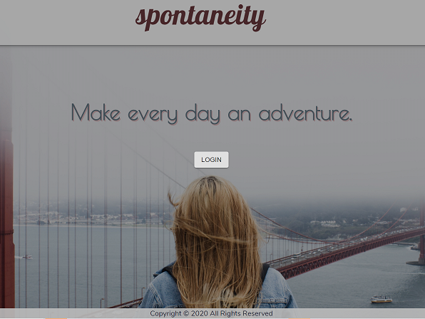
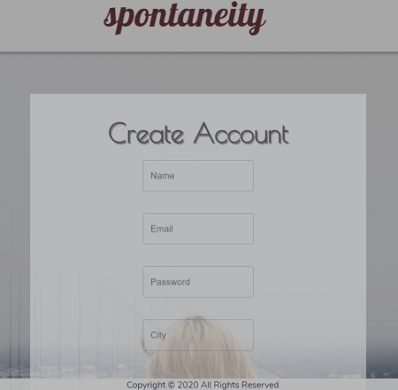
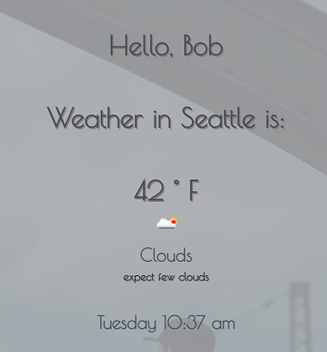
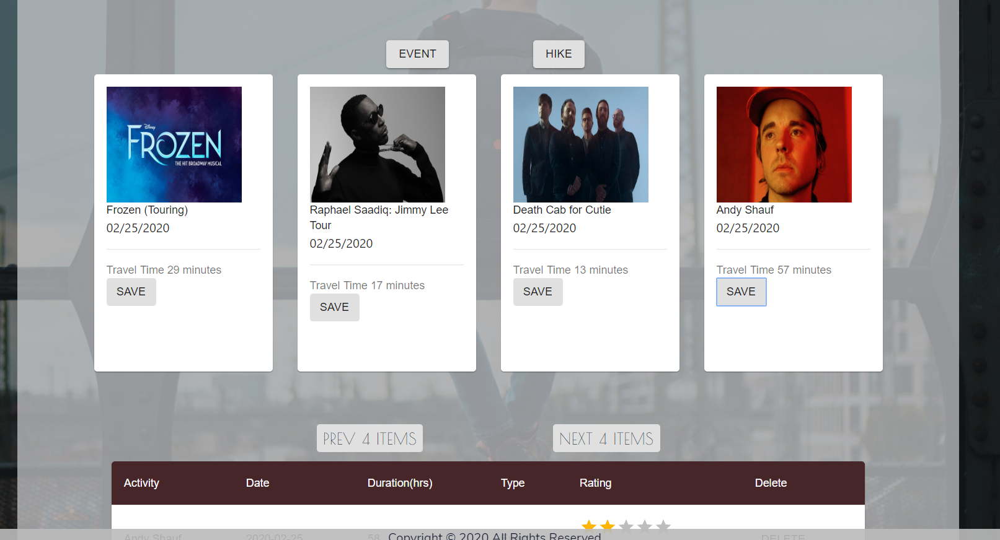

# Spontaneity

### A project by Alexa, Greg, Tyson and Jenny

## Table of Contents
[User Problem We Solved](#UserProblemWeSolved) 
[Our Solution](#OurSolution) 
[Technology](#Technology) 
[Feedback](#Feedback) 
[Thoughts](#Thoughts)
### User Problem We Solved
With our incredibly busy lives we still have free time! But the challenge is that we don’t always know when we will have that free time and if we will feel motivated to research what to do during that time.
We need a solution that easily gives us options of things to do near us in a given timeframe.

### Our Solution
Our web application allows users to indicate where they are and select from different events and hikes happening that day.
Out comes a list of events and hikes near the user that they can attend and rate afterward. This information gets stored to a table in the user’s profile.

### Technology Used
* Bycrpt
* Express
* Node

### Third Party 
* Styling: Material UI - https://material-ui.com/
* Styling: Bootstrap - https://getbootstrap.com/
* Unsplash - https://unsplash.com/
* Moment.js - https://momentjs.com/

### Server-Side 
* Distance: Google API- https://console.developers.google.com/google/maps-apis
* Trail Hikes: Hiking Project- https://www.hikingproject.com/data
* Events: TicketMaster -https://developer.ticketmaster.com/
* Weather: Open Weather - https://openweathermap.org/api

### NPM Packages

* "@date-io/date-fns": "^2.4.0",
* "@fortawesome/fontawesome-svg-core": "^1.2.27",
* "@fortawesome/free-solid-svg-icons": "^5.12.1",
* "@fortawesome/react-fontawesome": "^0.1.8",
* "@material-ui/core": "^4.9.2",
* "@material-ui/icons": "^4.9.1",
* "@material-ui/lab": "^4.0.0-alpha.43",
* "@testing-library/jest-dom": "^4.2.4",
* "@testing-library/react": "^9.4.0",
* "@testing-library/user-event": "^7.2.1",
* "axios": "^0.19.2",
* "materialize": "^1.0.0",
* "moment": "^2.24.0",
* "moment-timezone": "^0.5.28",
* "react": "^16.12.0",
* "react-dom": "^16.12.0",
* "react-moment": "^0.9.7",
* "react-places-autocomplete": "^7.2.1",
* "react-router-dom": "^5.1.2",
* "react-scripts": "3.4.0"

